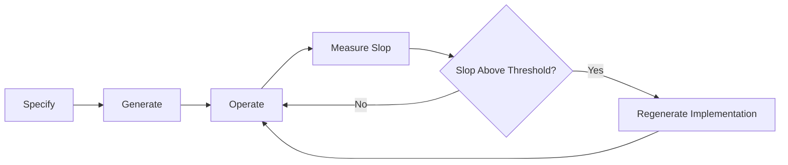
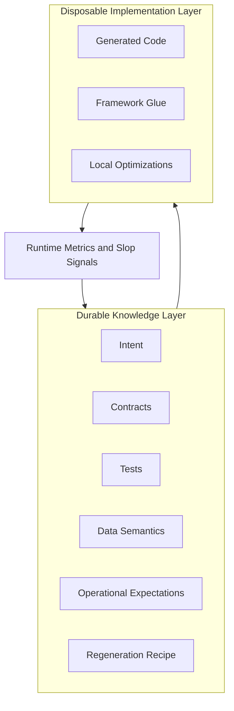
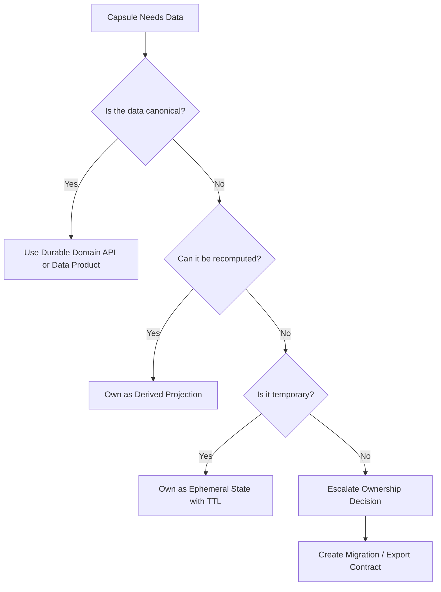

# Regenerable Architecture

> **Durable intent, disposable implementation.**

**Regenerable Architecture** preserves intent, contracts, tests, data semantics, and operational expectations as durable artifacts—and treats implementation code, especially AI-generated code, as disposable. When implementation quality decays past a measurable threshold, it is discarded and regenerated from those preserved artifacts rather than refactored in place.

The individual ingredients are established: evolutionary architecture, fitness functions, contract-first design, disposable infrastructure, code generation. The synthesis is the AI-era lifecycle that ties them together: *specify → generate → operate → measure slop → regenerate*. See [docs/concept.md](docs/concept.md) for the full concept.

---

## Who This Is For

This repository is intended for **software architects, principal engineers, and technical leaders** exploring architectural responses to AI-generated implementation code.

It is not intended to be a production framework, SDK, CLI, or developer productivity tool. The value here is conceptual and structural: a vocabulary, a lifecycle, and a set of artifacts for reasoning about AI-era systems — not a platform to deploy.

---

## What This Is Not

This repository does not provide a turnkey regeneration platform, a code-generation framework, or a universal scoring system. It does not automate the lifecycle. It does not replace the judgment required to define intent, write behavioral tests, or decide when to regenerate.

The implementation is illustrative. It exists to make the pattern concrete, not to demonstrate production readiness.

---

## Why This Exists

AI coding tools make generating implementation code cheap. The problem is not the cost of generation—it is the cost of trusting what was generated.

Over time, AI-generated code accumulates subtle problems:

- Logic that passes tests but has drifted from business intent
- Patterns borrowed from training data that don't fit the actual problem
- Abstractions added for pattern-matching, not for the problem at hand
- Dependencies pulled in for one line of convenience
- Tests that verify behavior the AI invented, not behavior the business requires

This is **AI slop**: accumulated implementation decay that looks acceptable in isolation but erodes the system's trustworthiness over time.

The problem compounds in teams. When multiple developers each use AI tools on the same codebase, their independently generated code conflicts: overlapping abstractions, inconsistent vocabulary, duplicate logic written in parallel. Capability capsules address this directly — each capsule has a clear owner, a fixed contract surface, and a boundary that AI tools cannot cross. Contributors work independently without generating conflicts.

The answer to decay is not more code review. Reviewing every AI-generated line for subtle correctness is expensive and unreliable. The answer is to design systems so that decayed implementation can be safely discarded and recreated—and to preserve the knowledge needed to do that safely.

Regenerable Architecture provides that design.

---

## The Core Lifecycle



Regenerable Architecture builds on evolutionary architecture but takes a different stance on what to preserve and what to discard:

| Approach | Principle |
|---|---|
| Evolutionary architecture | Make systems easy to change |
| Disposable architecture | Make components easy to replace |
| **Regenerable architecture** | **Make implementation safe to recreate from preserved intent** |

Classic evolutionary architecture says: *build → measure → refactor → evolve*.

Regenerable Architecture says: *specify → generate → operate → measure slop → regenerate*.

---

## Durable vs Disposable Artifacts



### Durable (preserve these)

| Artifact | Why Durable |
|---|---|
| `intent.md` | The business reason the capsule exists; survives every regeneration |
| Inbound contracts (`ports/inbound/`) | The public commitment to callers; callers depend on this |
| Outbound dependencies (`ports/outbound/`) | What this capsule consumes; constrains the regenerated implementation |
| Acceptance tests | Behavioral proof of what the system must do, independent of implementation |
| Invariant / property tests | Rules that must hold for all inputs, regardless of how the code is structured |
| Integration tests | Verify the outbound adapter against the real dependency after each regeneration |
| Data semantics | What each field means, who owns it, how it relates to the domain |
| Operational SLOs | Latency, error rate, and throughput expectations |
| Regeneration recipe | Step-by-step instructions for recreating the implementation correctly |
| Fitness function thresholds | The team's definition of "healthy"—set in advance, not rationalized after the fact |
| System manifest (`system.yaml`) | Dependency graph across all capsules; enables safe regeneration sequencing |

### Disposable (safe to discard and recreate)

| Artifact | Why Disposable |
|---|---|
| Implementation code | Recreatable when durable artifacts are strong |
| Framework glue | Can be rewritten for any framework that fits the contract |
| Local optimizations | Should be re-derived after regeneration, not carried forward blindly |
| Tests for implementation internals | Likely to break on regeneration for the wrong reasons |

The implementation is not unimportant. It is just not the artifact that carries long-term trust. The durable layer carries that.

---

## Capability Capsules

A **capability capsule** is the unit of regenerability.

It bundles everything needed to specify, generate, operate, and regenerate a single business capability.

A capability capsule is **not** a microservice — the boundary is conceptual and knowledge-preserving, not a deployment decision. It can be a module, a serverless function group, a workflow, a domain layer in a modular monolith, or a deployable service when isolation genuinely justifies the overhead.

---

## What Is AI Slop?

**AI slop** is the accumulation of small, individually defensible implementation choices that together erode the quality and trustworthiness of a system.

Signs of AI slop:

- Functions that are technically correct but too long to reason about confidently
- Abstractions that exist because the model completed a pattern, not because the problem requires them
- Duplicated logic in slightly different forms across the codebase
- Imports pulled in for a single line of convenience
- Tests that verify AI-invented behavior, not business behavior
- Implementation vocabulary that has drifted from the domain
- Business rules embedded in utility functions where they will not be found on review

AI slop is not malicious. It is the natural byproduct of generation without architectural discipline.

See [docs/ai-slop.md](docs/ai-slop.md) for a detailed taxonomy and how each pattern manifests.

---

## Fitness Functions

The architecture includes two complementary sets of fitness functions. Both use the same interface contract and can be run from the same runner.

### Implementation Fitness (Slop)

Measures whether the implementation layer has decayed to the point where regeneration is safer than further refactoring.

### Slop Score Formula

```
Slop Score =
  complexity_score
+ duplication_score
+ dependency_score
+ semantic_drift_score
+ changeability_score
- test_confidence_score
```

Normalized to 0–100. Test confidence is subtracted because strong tests reduce the risk that slop has caused undetected behavioral drift.

| Score | Status | Recommended Action |
|---|---|---|
| 0–30 | Healthy | Maintain |
| 31–50 | Watch | Monitor trends |
| 51–70 | Warning | Refactor |
| 71–85 | High | Regenerate |
| 86–100 | Critical | Urgent regeneration |

Thresholds are configurable. A team with comprehensive test coverage may tolerate higher complexity; a regulated-domain team may want stricter thresholds on semantic drift.

See [fitness-functions/README.md](fitness-functions/README.md) for the signal specification, interface contract, and tool alternatives (SonarQube, ESLint, Roslyn analyzers, and others). The reference Python implementation is in [examples/pricing-discount-capsule/fitness/](examples/pricing-discount-capsule/fitness/).

### Durable Health Fitness

Measures whether the durable artifacts themselves are internally consistent — whether intent, tests, contracts, stubs, and the regeneration recipe still describe the same capsule. A capsule with low slop but high durable health drift is unsafe to regenerate: the regenerated implementation will be guided by inconsistent artifacts and will fail in ways the tests do not catch.

Durable health checks run in two tiers: mechanical checks (file integrity, contract coverage, stub consistency) run continuously in CI; LLM-assisted checks (intent-test alignment, contract-intent alignment, recipe currency) run as a pre-regeneration gate.

**Durable health must gate regeneration. Slop scores alone do not.**

See [fitness-functions/durable-health.md](fitness-functions/durable-health.md) for the full specification.

---

## When to Refactor vs Regenerate

```mermaid
flowchart TD
    A[Change Request] --> B{Tests and Contracts Strong?}
    B -- No --> C[Strengthen Durable Artifacts First]
    C --> B
    B -- Yes --> D{Slop Score High?}
    D -- No --> E[Modify Existing Implementation]
    D -- Yes --> F[Regenerate from Durable Artifacts]
    F --> G[Run Fitness Functions]
    G --> H{Pass?}
    H -- Yes --> I[Deploy]
    H -- No --> J[Fix Spec, Tests, or Generation Recipe]
    J --> F
```



**Refactor** when:
- The slop score is low
- The change is localized and the logic is well-understood
- The existing implementation is a reasonable foundation for the change

**Regenerate** when:
- The slop score is above the regeneration threshold
- The implementation has diverged from intent widely enough that surgery is riskier than a clean start
- A significant requirement change makes the existing structure a poor foundation
- You cannot confidently explain what the current implementation does

The key constraint: regeneration is only safe when the durable artifacts are strong. If tests are weak, strengthen them first. A regeneration guided by poor tests produces a new implementation with the same or different behavioral gaps—and no way to detect them.

---

## Data Strategies for Many Capsules

When a system has many capability capsules, data ownership becomes a systemic concern.

The anti-pattern to avoid is **distributed slop**: each disposable capsule owns its own canonical database, leading to duplicated domain models, inconsistent data semantics, and unresolvable conflicts when capsules need to be reconciled or regenerated.



Every capsule should classify its data before owning it:

| Class | Description | Lifecycle |
|---|---|---|
| **Canonical** | Authoritative business record | Must survive capsule regeneration; own via a durable domain API |
| **Derived** | Projection of canonical data | Can be discarded and rebuilt; owned by the capsule |
| **Ephemeral** | Temporary state with a TTL | Loss is acceptable; session caches, rate counters, drafts |
| **Audit** | Append-only record of events | Must survive regeneration; append-only means safe to preserve |
| **Configuration** | Governs behavior | Externalize from the implementation |
| **Personal/sensitive** | Subject to privacy regulation | Requires lifecycle governance regardless of capsule lifecycle |

Only canonical, audit, and personal/sensitive data require strong durability discipline. The rest can be treated as part of the disposable layer.

See [docs/data-strategies.md](docs/data-strategies.md) for the full treatment including outbox/inbox patterns, event replay, and migration contracts.

---

## Repository Structure

```
regenerable-architecture/
├── README.md
├── system.yaml                  ← durable: capsule dependency graph
├── docs/
│   ├── concept.md                        ← in-depth explanation of the architecture
│   ├── novelty.md                        ← what is new, what is borrowed
│   ├── ai-slop.md                        ← taxonomy of AI slop patterns
│   ├── data-strategies.md                ← data ownership strategies for capsule systems
│   ├── anti-patterns.md                  ← failure modes and how to avoid them
│   ├── when-not-to-use.md                ← contraindications for this pattern
│   ├── capsule-assessment-checklist.md   ← evaluate a proposed capsule boundary
│   ├── regeneration-readiness-checklist.md ← verify readiness before regenerating
│   ├── adoption-maturity-model.md        ← staged adoption guide
│   └── open-questions.md                 ← unresolved questions
├── examples/
│   ├── pricing-discount-capsule/    ← leaf capsule: no outbound dependencies
│   │   ├── intent.md                ← durable: business intent
│   │   ├── regeneration-recipe.md   ← durable: how to regenerate
│   │   ├── ports/
│   │   │   ├── inbound/
│   │   │   │   └── openapi.yaml     ← durable: public API contract
│   │   │   └── outbound/
│   │   │       └── dependencies.yaml ← durable: outbound deps (empty)
│   │   ├── src/
│   │   │   └── pricing_discount_service.py  ← disposable: implementation
│   │   ├── tests/
│   │   │   ├── test_acceptance.py   ← durable: behavioral tests
│   │   │   ├── test_contract.py     ← durable: contract conformance
│   │   │   └── test_invariants.py   ← durable: invariant tests
│   │   ├── fitness/
│   │   │   ├── slop_score.py        ← durable: reference fitness runner
│   │   │   ├── complexity_check.py  ← durable: reference implementation
│   │   │   ├── duplication_check.py
│   │   │   ├── dependency_check.py
│   │   │   ├── test_confidence_check.py
│   │   │   ├── semantic_drift_check.py
│   │   │   └── changeability_check.py
│   │   └── README.md
│   └── order-capsule/               ← dependent capsule: consumes pricing-discount-capsule
│       ├── intent.md                ← durable: business intent
│       ├── regeneration-recipe.md   ← durable: how to regenerate
│       ├── ports/
│       │   ├── inbound/
│       │   │   └── openapi.yaml     ← durable: public API contract
│       │   └── outbound/
│       │       └── dependencies.yaml ← durable: declares pricing-discount-capsule dependency
│       ├── src/
│       │   └── order_service.py     ← disposable: implementation
│       ├── tests/
│       │   ├── test_acceptance.py   ← durable: behavioral tests (stub discount service)
│       │   ├── test_contract.py     ← durable: contract conformance
│       │   ├── test_invariants.py   ← durable: invariant tests
│       │   └── test_integration.py  ← durable: outbound adapter against real capsule
│       ├── fitness/
│       └── README.md
├── fitness-functions/
│   └── README.md                ← signal spec and tool alternatives (language-agnostic)
├── scripts/
│   ├── run-fitness.sh
│   └── regenerate-example.sh
├── Makefile
├── pyproject.toml
└── LICENSE
```

The durable / disposable distinction is structural: `intent.md`, `ports/`, `tests/`, and `fitness/` are preserved across regenerations; `src/` is the disposable output. The `system.yaml` at the root preserves the dependency graph across all capsules.

---

## About the Examples

The examples are deliberately small. Their purpose is to make the architectural pattern concrete and reviewable — not to demonstrate production readiness or developer usability.

A real capability capsule would have more complex domain logic, richer test suites, and more detailed regeneration recipes. The examples show the structure and the artifact relationships. They are reference points for understanding, not templates to copy directly into production systems.

---

## Demo

```bash
# Install dependencies (pytest)
make install

# Run the behavioral, invariant, and contract test suite
make test

# Run fitness functions against the example capsule
make fitness

# Run tests + fitness together
make demo
```

Expected output from `make fitness`:

```json
{
  "complexity_score": 14.1,
  "duplication_score": 9.9,
  "dependency_score": 16.0,
  "semantic_drift_score": 4.3,
  "changeability_score": 11.0,
  "test_confidence_score": 100.0,
  "slop_score": 0,
  "status": "healthy",
  "recommended_action": "maintain"
}
```

A `test_confidence_score` of 100 offsets the structural scores, producing a net slop score of 0 — the expected result for a freshly specified, well-tested capsule.

See [examples/pricing-discount-capsule/](examples/pricing-discount-capsule/) for the leaf capsule example, and [examples/order-capsule/](examples/order-capsule/) for a dependent capsule that consumes it via a declared outbound port. The `system.yaml` at the repository root shows the dependency graph across both.

---

## Related Existing Concepts

The individual ingredients in Regenerable Architecture are established ideas with existing names and tooling. The table below shows what each contributes. The distinctive claim is not that any one of them is novel—it is that combining them for the AI-era lifecycle creates a coherent approach that none addresses on its own.

| Concept | Relationship |
|---|---|
| Evolutionary architecture | Parent concept; RA specializes it for AI-generated code and adds regeneration as a first-class event |
| Architecture fitness functions | Used directly as the slop measurement mechanism |
| Contract-first development | Contracts are elevated from a design technique to a durable artifact |
| Consumer-driven contracts | Informs why outbound port declarations must represent genuine consumer commitments |
| Hexagonal architecture (ports and adapters) | Inbound/outbound port structure maps directly; adapters are disposable, ports are durable |
| Disposable architecture | RA provides the lifecycle discipline that makes disposability safe |
| Microservices / modular monolith | Capsules can be either; the capsule boundary is conceptual, not topological |
| Code generation / scaffolding | Generation is the cheap step; RA adds measurement and regeneration around it |
| Event sourcing / CQRS | State-rebuild-by-replay makes capsule local state safely disposable |
| Immutable infrastructure | Same philosophy—replace rather than patch—applied to application code |
| Infrastructure as code | Durable intent applied to infrastructure; RA applies the same to application logic |
| Data mesh / data products | Governs canonical data ownership outside disposable capsules |
| Property-based testing | Invariant tests that survive regeneration unchanged |
| Golden-master testing | Useful post-regeneration to detect behavioral drift |

See [docs/novelty.md](docs/novelty.md) for a deeper treatment of each relationship and what is genuinely new in the synthesis.

---

## Anti-Patterns

Full descriptions in [docs/anti-patterns.md](docs/anti-patterns.md). Key failure modes:

- **Distributed slop** — every capsule owns a canonical database; data conflicts become unresolvable
- **Prompt as specification** — the original prompt is treated as sufficient documentation; regeneration fails
- **Regeneration without tests** — deleting and rebuilding code without strong behavioral tests is just risky rewriting
- **Contract drift** — implementation changes behavior without updating the public contract
- **Semantic drift** — code passes tests but no longer represents business intent
- **Nano-service explosion** — the capsule boundary is misread as a deployment boundary; operational costs multiply
- **Fitness function theater** — metrics are measured but thresholds are never acted on
- **Durable artifact neglect** — intent documents and recipes are created once and never updated

---

## Architect-Level Reference

Reference artifacts for applying and evaluating the pattern:

- [docs/capsule-assessment-checklist.md](docs/capsule-assessment-checklist.md) — evaluate whether a proposed capsule boundary is well-defined before writing the first artifact
- [docs/regeneration-readiness-checklist.md](docs/regeneration-readiness-checklist.md) — verify that durable artifacts are strong enough to regenerate safely
- [docs/adoption-maturity-model.md](docs/adoption-maturity-model.md) — understand how teams adopt the pattern incrementally, from no discipline to active regeneration lifecycle
- [docs/when-not-to-use.md](docs/when-not-to-use.md) — recognize when the pattern is the wrong choice for the context

---

## Open Questions

Full discussion in [docs/open-questions.md](docs/open-questions.md). Key unresolved questions:

- How do you detect semantic drift reliably without LLM-assisted review?
- What is the right granularity for a capability capsule?
- How should fitness function thresholds evolve as a team and codebase mature?
- How do you govern regeneration decisions in teams with many contributors?
- At what point does a disposable capsule earn the right to become a durable domain?

---

## License

MIT. See [LICENSE](LICENSE).
