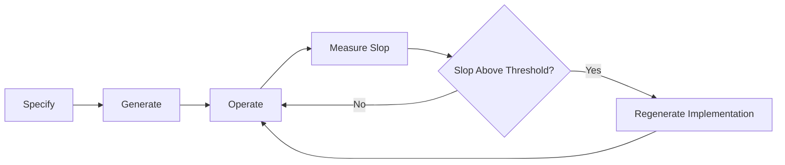
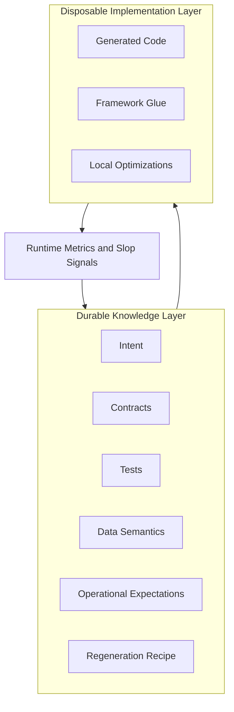
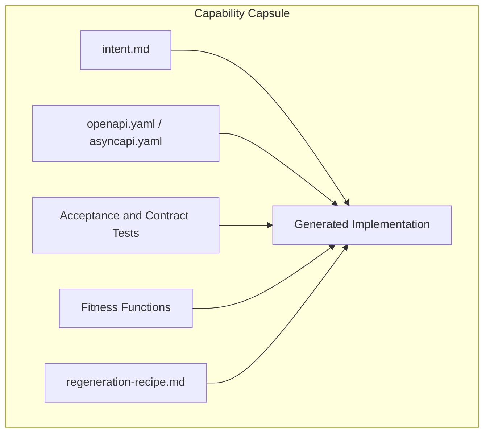
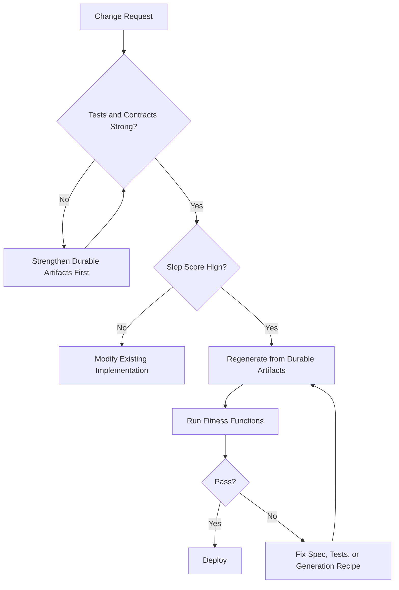
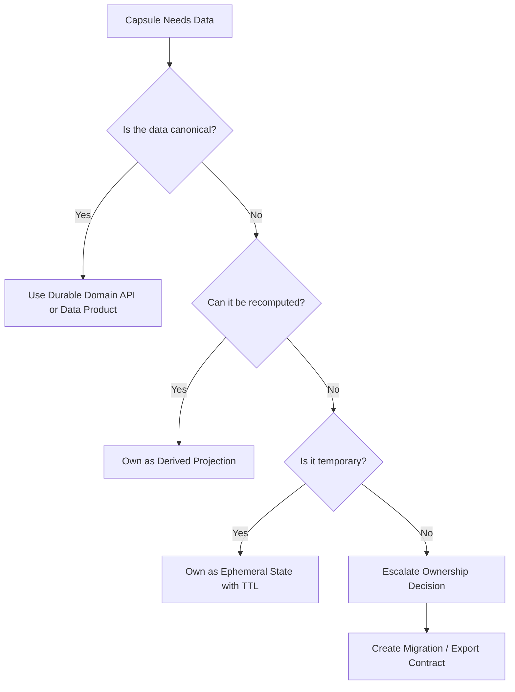

# Regenerable Architecture

> **Durable intent, disposable implementation.**

## One-Sentence Definition

Regenerable Architecture is a software architecture approach where implementation code—especially AI-generated code—is treated as disposable, while intent, contracts, tests, data semantics, and operational expectations are preserved as durable assets from which the implementation can be safely recreated.

---

## Why This Exists

AI coding tools make generating implementation code cheap. The problem is not the cost of generation—it is the cost of trusting what was generated.

Over time, AI-generated code accumulates subtle problems:

- Logic that passed tests but drifted from business intent
- Patterns copied from training data without fitting the actual problem
- Abstractions added for cleverness, not clarity
- Dependencies added without ownership or review
- Tests that verify behavior the AI invented rather than behavior the business requires

This is **AI slop**: the slow accumulation of implementation debt that looks fine on the surface but erodes trust in the system.

Traditional refactoring helps. But sometimes the right move is not to refactor—it is to **regenerate from scratch**, guided by durable artifacts that were never thrown away.

Regenerable Architecture makes this safe and deliberate.

---

## The Core Lifecycle



This differs from classic evolutionary architecture:

| Approach | Slogan |
|---|---|
| Evolutionary architecture | Make systems easy to change |
| Disposable architecture | Make components easy to replace |
| **Regenerable architecture** | **Make implementation cheap and safe to recreate from durable knowledge** |

Classic evolutionary architecture says: *build → measure → refactor → evolve*.

Regenerable Architecture says: *specify → generate → operate → measure slop → regenerate*.

The difference is that regeneration is not a failure mode. It is a planned, supported lifecycle event. The architecture is designed around it from the start.

---

## Durable vs Disposable Artifacts



### Durable (preserve these)

| Artifact | Why Durable |
|---|---|
| `intent.md` | Captures the business reason the capsule exists |
| OpenAPI / AsyncAPI contracts | The public commitment to callers |
| Acceptance tests | Behavioral proof of what the system must do |
| Invariant / property tests | The rules that must never be violated |
| Data semantics | What the data means and who owns it |
| Operational SLOs | Latency, error rate, throughput expectations |
| Regeneration recipe | How to recreate the implementation correctly |
| Fitness function thresholds | What "healthy" looks like, defined in advance |

### Disposable (safe to throw away and recreate)

| Artifact | Why Disposable |
|---|---|
| Implementation code | Can be regenerated if durable artifacts are strong |
| Framework glue | Can be rewritten for any framework that fits the contract |
| Local optimizations | Should be re-derived after regeneration |
| Generated tests for implementation details | Can drift; prefer behavioral tests |

This does not mean the implementation is unimportant. It means the architecture is designed so that the implementation can be recreated without loss of knowledge or trust.

---

## Capability Capsules

A **capability capsule** is the unit of regenerability.

It bundles everything needed to specify, generate, operate, and regenerate a single business capability.



A capability capsule does **not** have to be a microservice. It can be:

- A Python module or package
- A serverless function group
- A workflow or job
- A domain layer inside a modular monolith
- A deployable service when isolation genuinely matters

The boundary is conceptual, not deployment-topology.

---

## What Is AI Slop?

**AI slop** is the accumulation of small, individually defensible implementation choices that together erode the quality and trustworthiness of a system.

Signs of AI slop:

- Functions that are technically correct but too long to reason about
- Abstractions introduced for pattern-matching, not for the actual problem
- Duplicated logic in slightly different forms
- Imports pulled in for one line of convenience
- Tests that verify AI-invented behavior, not business behavior
- Terminology that drifted from the domain vocabulary
- Comments that explain what the code does, not why
- Business rules embedded in utility functions where they will not be found

AI slop is not malicious. It is the natural byproduct of generation without architectural discipline.

---

## Slop Fitness Functions

Slop is measurable. The architecture includes fitness functions that run continuously or on a schedule.

### Slop Score Formula

```
Slop Score =
  complexity_score
+ duplication_score
+ dependency_score
+ semantic_drift_score
+ changeability_score
- test_confidence_score
```

Normalized to 0–100.

| Score | Status | Recommended Action |
|---|---|---|
| 0–30 | Healthy | Maintain |
| 31–50 | Watch | Monitor trends |
| 51–70 | Warning | Refactor |
| 71–85 | High | Regenerate |
| 86–100 | Critical | Urgent regeneration |

See [fitness-functions/](fitness-functions/) for working implementations.

---

## When to Refactor vs Regenerate



**Refactor** when:
- The slop score is low
- The change is localized
- The existing logic is well-understood

**Regenerate** when:
- The slop score is high
- The implementation has drifted from intent
- A broader change makes a clean slate cheaper than surgery
- You cannot confidently explain what the current implementation does

The key insight: regeneration is only safe when durable artifacts are strong. If tests are weak, strengthen them before regenerating—not after.

---

## Data Strategies for Many Capsules

When a system has many capability capsules, data ownership becomes critical.

Avoid the **distributed slop** anti-pattern: each disposable capsule owns its own canonical database, leading to duplicated models, inconsistent behavior, and unmappable state.



Every capsule should classify its data:

- **Canonical** — must be owned by a durable domain API
- **Derived** — projection; can be rebuilt
- **Ephemeral** — TTL-scoped; loss is acceptable
- **Audit** — append-only; must survive regeneration
- **Configuration** — governs behavior; should be externalized
- **Personal/sensitive** — requires lifecycle governance

See [docs/data-strategies.md](docs/data-strategies.md) for the full treatment.

---

## Example Repository Structure

```
regenerable-architecture/
├── README.md
├── docs/
│   ├── concept.md
│   ├── novelty.md
│   ├── ai-slop.md
│   ├── data-strategies.md
│   ├── anti-patterns.md
│   └── open-questions.md
├── examples/
│   └── pricing-discount-capsule/
│       ├── intent.md
│       ├── regeneration-recipe.md
│       ├── contracts/
│       │   └── openapi.yaml
│       ├── src/
│       │   └── pricing_discount_service.py
│       ├── tests/
│       │   ├── test_acceptance.py
│       │   ├── test_contract.py
│       │   └── test_invariants.py
│       ├── fitness/
│       │   ├── slop_score.py
│       │   ├── complexity_check.py
│       │   ├── duplication_check.py
│       │   ├── dependency_check.py
│       │   └── semantic_drift_check.py
│       └── README.md
├── fitness-functions/
│   ├── README.md
│   ├── slop_score.py
│   ├── complexity_check.py
│   ├── duplication_check.py
│   ├── dependency_check.py
│   ├── test_confidence_check.py
│   ├── changeability_check.py
│   └── semantic_drift_check.py
├── scripts/
│   ├── run-fitness.sh
│   └── regenerate-example.sh
├── Makefile
├── pyproject.toml
└── LICENSE
```

---

## Demo

```bash
# Install dependencies
make install

# Run tests
make test

# Run fitness functions against the example capsule
make fitness

# Run the full demo
make demo
```

Expected output from `make fitness`:

```json
{
  "complexity_score": 11.3,
  "duplication_score": 12.1,
  "dependency_score": 12.3,
  "semantic_drift_score": 4.3,
  "changeability_score": 0.0,
  "test_confidence_score": 100.0,
  "slop_score": 0,
  "status": "healthy",
  "recommended_action": "maintain"
}
```

The `test_confidence_score` of 100 reflects 43 tests covering acceptance behaviour,
invariants, and contract conformance — strong enough to make regeneration safe.
The high confidence completely offsets the structural scores, producing a net slop
score of 0. This is the expected result for a freshly specified, well-tested capsule.

See [examples/pricing-discount-capsule/](examples/pricing-discount-capsule/) for the full working example.

---

## Related Existing Concepts

Regenerable Architecture builds on established ideas. The individual ingredients are not new:

| Concept | Relationship |
|---|---|
| Evolutionary architecture | Parent concept; RA specializes it for AI-generated code |
| Architecture fitness functions | Directly used as slop measurement mechanism |
| Contract-first development | Contracts are durable; RA makes them the specification source |
| Consumer-driven contracts | Informs contract durability strategy |
| Disposable architecture | RA formalizes the lifecycle that makes disposability safe |
| Microservices | Capsules may be services, but do not have to be |
| Modular monolith | Capsules work inside monoliths |
| Code generation / scaffolding | Generation is the core cheap step in the lifecycle |
| Event sourcing | State rebuild by replay enables capsule regeneration |
| CQRS | Separates read/write shapes that capsules may own separately |
| Immutable infrastructure | Same philosophy applied to code: replace, don't patch |
| Infrastructure as code | Durable intent applied to infrastructure |
| Data mesh / data products | Governs canonical data outside disposable capsules |
| Property-based testing | Strong invariant tests that survive regeneration |
| Golden-master testing | Useful for detecting behavioral drift post-regeneration |

See [docs/novelty.md](docs/novelty.md) for a deeper treatment of the distinctions.

---

## Anti-Patterns

See [docs/anti-patterns.md](docs/anti-patterns.md) for the full list. Key anti-patterns:

- **Distributed slop**: every capsule owns a canonical database
- **Prompt as specification**: treating the original prompt as sufficient documentation
- **Regeneration without tests**: deleting code without strong behavioral tests
- **Contract drift**: implementation changes behavior without updating the contract
- **Semantic drift**: code passes tests but no longer represents business intent
- **Nano-service explosion**: every feature becomes a separately deployed service

---

## Open Questions

See [docs/open-questions.md](docs/open-questions.md). Key open questions:

- How do you detect semantic drift reliably without LLM-assisted review?
- What is the right granularity for a capability capsule?
- How do fitness function thresholds evolve as systems mature?
- How do you govern regeneration in teams with many contributors?
- When does a disposable capsule earn the right to become a durable domain?

---

## License

MIT. See [LICENSE](LICENSE).
