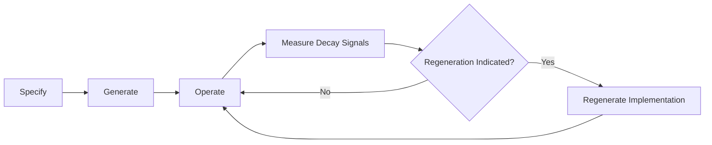
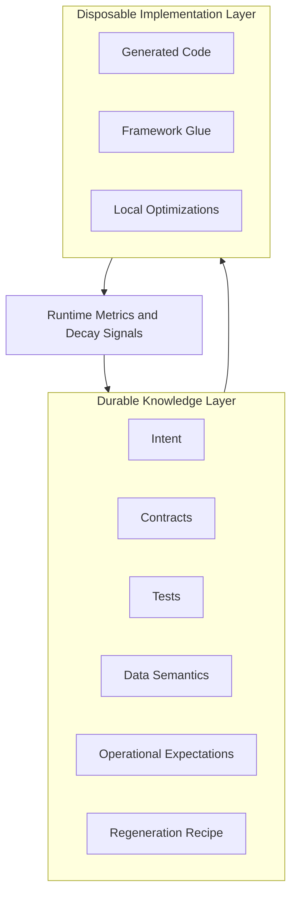
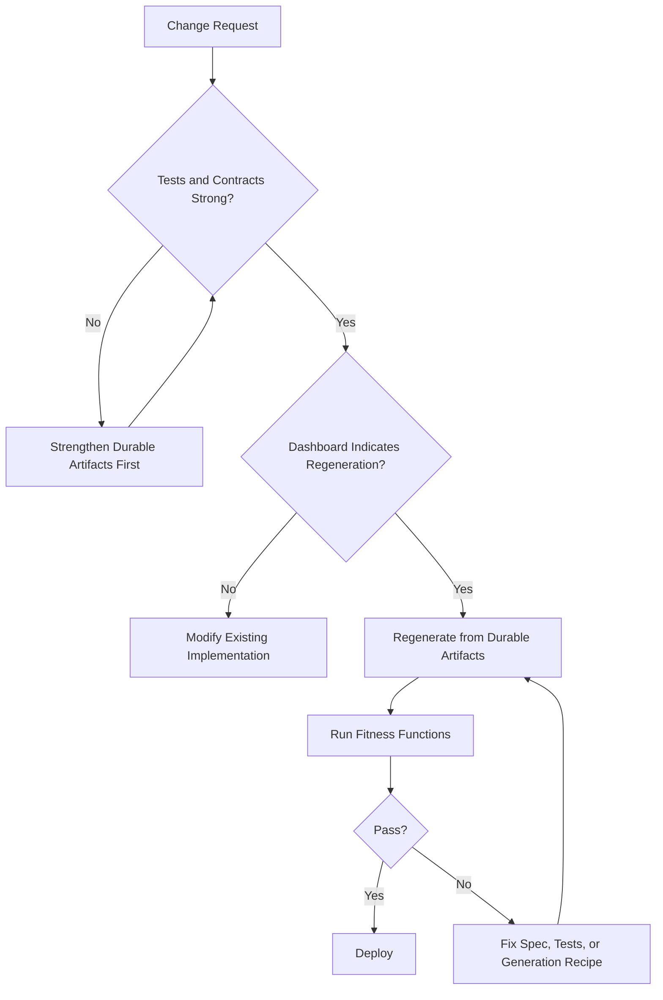
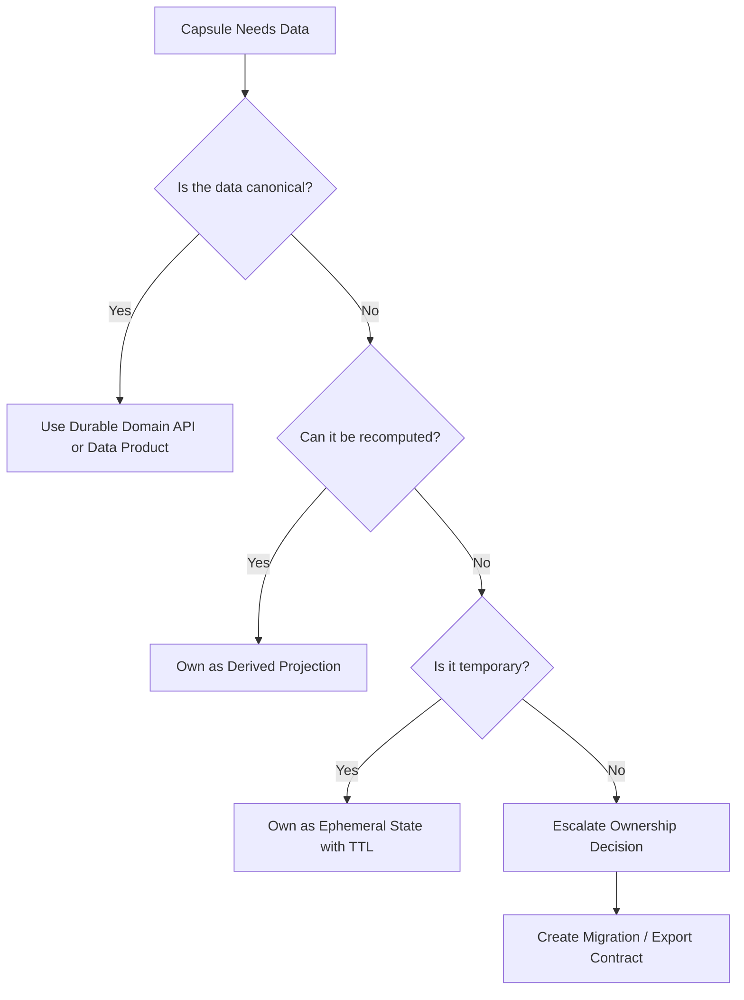

# Regenerable Architecture

> **Durable intent, disposable implementation.**

**Regenerable Architecture** preserves intent, contracts, tests, data semantics, and operational
expectations as durable artifacts—and treats implementation code, especially AI-generated code, as
disposable. When implementation quality decays past a measurable threshold, it is discarded and
regenerated from those preserved artifacts rather than refactored in place.

The individual ingredients are established: evolutionary architecture, fitness functions,
contract-first design, disposable infrastructure, code generation. The synthesis is the AI-era
lifecycle that ties them together: *specify → generate → operate → measure decay signals →
regenerate*. See [docs/concept.md](docs/concept.md) for the full concept.

---

## Who This Is For

This repository is intended for **software architects, principal engineers, and technical leaders**
exploring architectural responses to AI-generated implementation code. It is conceptual and structural — a vocabulary, a lifecycle, and a set of artifacts for reasoning about AI-era systems — not a production framework, SDK, or platform to deploy.

It does not automate the lifecycle or replace the judgment required to define intent, write behavioral tests, or decide when to regenerate. The implementation is illustrative: it exists to make the pattern concrete, not to demonstrate production readiness.

---

## Cost and Overhead

This pattern carries a real, ongoing documentation tax. Per capsule, teams must maintain intent, contracts, behavioral tests, invariant tests, a regeneration recipe, and signal dashboard thresholds — all of which must stay current as the domain evolves. A stale durable artifact produces a wrong implementation when regeneration is attempted.

The bet is that this maintenance cost is less than the cost of debugging and rewriting decayed AI-generated code. That bet pays off when regeneration occurs often enough to amortize the discipline. It does not pay off when the team is small, the product is in early discovery, or regeneration would be rare. See [docs/cost-and-overhead.md](docs/cost-and-overhead.md) for the full treatment and contraindications.

---

## Why This Exists

AI coding tools make generating implementation code cheap. The problem is not the cost of
generation—it is the cost of trusting what was generated.

Over time, AI-generated code accumulates subtle problems:

- Logic that passes tests but has drifted from business intent
- Patterns borrowed from training data that don't fit the actual problem
- Abstractions added for pattern-matching, not for the problem at hand
- Dependencies pulled in for one line of convenience
- Tests that verify behavior the AI invented, not behavior the business requires

This is **[AI implementation decay](docs/implementation-decay.md)**: accumulated degradation that looks acceptable in isolation but erodes
the system's trustworthiness over time.

The problem compounds in teams. When multiple developers each use AI tools on the same codebase,
their independently generated code conflicts: overlapping abstractions, inconsistent vocabulary,
duplicate logic written in parallel. Capability capsules address this directly — each capsule has a
clear owner, a fixed contract surface, and a boundary that AI tools cannot cross. Contributors work
independently without generating conflicts.

The answer to decay is not more code review. Reviewing every AI-generated line for subtle
correctness is expensive and unreliable. The answer is to design systems so that decayed
implementation can be safely discarded and recreated—and to preserve the knowledge needed to do that
safely.

---

## The Core Lifecycle



Where evolutionary architecture asks "how do we make systems easy to change?", this asks "how do we make implementation safe to recreate from preserved intent?"

---

## Durable vs Disposable Artifacts



### Durable (preserve these)

| Artifact | Why Durable |
|---|---|
| `intent.md` | The business reason the capsule exists; survives every regeneration |
| Inbound contracts (`ports/inbound/`) | The public commitment to callers; callers depend on this |
| Outbound dependencies (`ports/outbound/`) | What this capsule consumes; constrains the regenerated implementation |
| Acceptance tests | Behavioral proof of what the system must do, independent of implementation |
| Invariant / property tests | Rules that must hold for all inputs, regardless of how the code is structured |
| Integration tests | Verify the outbound adapter against the real dependency after each regeneration |
| Data semantics | What each field means, who owns it, how it relates to the domain |
| Operational SLOs | Latency, error rate, and throughput expectations |
| Regeneration recipe | Step-by-step instructions for recreating the implementation correctly |
| Fitness function thresholds | The team's definition of "healthy"—set in advance, not rationalized after the fact |
| System manifest (`system.yaml`) | Dependency graph across all capsules; enables safe regeneration sequencing |

### Disposable (safe to discard and recreate)

| Artifact | Why Disposable |
|---|---|
| Implementation code | Recreatable when durable artifacts are strong |
| Framework glue | Can be rewritten for any framework that fits the contract |
| Local optimizations | Should be re-derived after regeneration, not carried forward blindly |
| Tests for implementation internals | Likely to break on regeneration for the wrong reasons |

---

## Capability Capsules

A **capability capsule** is the unit of regenerability.

It bundles everything needed to specify, generate, operate, and regenerate a single business
capability.

A capability capsule is **not** a microservice — the boundary is conceptual and
knowledge-preserving, not a deployment decision. It can be a module, a serverless function group, a
workflow, a domain layer in a modular monolith, or a deployable service when isolation genuinely
justifies the overhead.

---

## The Regeneration Recipe

The **regeneration recipe** is the version-controlled instructions for recreating a capsule's implementation from its durable artifacts. It makes regeneration repeatable rather than ad hoc — especially through its "Known regeneration hazards" section, which accumulates the specific ways this capsule's generator has historically failed. Every failed regeneration should produce at least one new entry.

See [`docs/regeneration-recipe-guide.md`](docs/regeneration-recipe-guide.md) for what makes a recipe good, and the worked examples in [`examples/pricing-discount-capsule/regeneration-recipe.md`](examples/pricing-discount-capsule/regeneration-recipe.md) and [`examples/order-capsule/regeneration-recipe.md`](examples/order-capsule/regeneration-recipe.md).

---

## Fitness Functions

The architecture includes two complementary sets of fitness functions. Both use the same interface
contract and can be run from the same runner.

### Implementation Decay Signals

The five mechanical signals each carry their own status: `healthy`, `watch`, `warning`, or
`critical`. They do not combine into a single number. A signal dashboard presents them side by side;
regeneration is triggered by a policy evaluated across that dashboard.

The signals are qualitatively different and do not share units — complexity accumulates in function
structure, duplication accumulates in code blocks, dependency accumulation is a count, test
confidence is an inverted coverage measure, and changeability tracks churn. Summing them into a
single score invites argument about the arithmetic rather than about the thresholds. A dashboard
makes asymmetric, domain-specific calibration natural.

| Signal | Measures | `critical` means |
|---|---|---|
| Complexity | Function length, branching, nesting depth | Structural complexity makes the implementation unreliable to modify |
| Duplication | Repeated lines and duplicate code blocks | A rule change will likely be applied inconsistently across copies |
| Dependency accumulation | External import count, discouraged libraries | Regeneration surface is wide or discouraged libraries are present |
| Test confidence | Behavioral test coverage, suite pass/fail | Tests are insufficient to verify a regenerated implementation |
| Changeability | Git churn, TODO/FIXME/HACK markers | Implementation thrash that targeted editing cannot resolve |

**Default regeneration policy.** Regenerate when any one of the following holds: a judgment signal
is in `warning` or `critical`; two or more mechanical signals are in `warning`; any single
mechanical signal is in `critical`. This policy is a calibration starting point. Teams should expect
to adjust it after the first few regeneration cycles, based on observed false positives and false
negatives.

Semantic drift — whether the implementation has behaviorally diverged from `intent.md` — is a
judgment signal, not a mechanical one. It runs at the pre-regeneration gate rather than on every
commit. See [fitness-functions/README.md](fitness-functions/README.md) for the full signal
specification, per-signal status descriptions, and tool alternatives (SonarQube, ESLint, Roslyn
analyzers, and others). The reference Python implementation is in
[examples/pricing-discount-capsule/fitness/](examples/pricing-discount-capsule/fitness/).

### Artifact Drift Fitness

Measures whether the durable artifacts themselves are internally consistent — whether intent, tests,
contracts, stubs, and the regeneration recipe still describe the same capsule. A capsule with a
healthy signal dashboard but a high artifact drift score is unsafe to regenerate: the regenerated
implementation will be guided by inconsistent artifacts and will fail in ways the tests do not catch.

Artifact drift checks run in two tiers: mechanical checks (file integrity, contract coverage, stub
consistency) run continuously in CI; LLM-assisted checks (intent-test alignment, contract-intent
alignment, recipe currency) run as a pre-regeneration gate.

**Artifact drift must gate regeneration. The signal dashboard alone does not.**

See [fitness-functions/artifact-drift.md](fitness-functions/artifact-drift.md) for the full
specification.

---

## When to Refactor vs Regenerate



**Refactor** when:
- The signal dashboard shows all mechanical signals healthy or watch
- The change is localized and the logic is well-understood
- The existing implementation is a reasonable foundation for the change
- You can confidently explain what the current implementation does and why

**Regenerate** when:
- The dashboard policy triggers regeneration
- The implementation has diverged from intent widely enough that surgery is riskier than a clean start
- A significant requirement change makes the existing structure a poor foundation
- You cannot confidently explain what the current implementation does

The key constraint: regeneration is only safe when the durable artifacts are strong. If tests are
weak, strengthen them first. A regeneration guided by poor tests produces a new implementation with
the same or different behavioral gaps—and no way to detect them.

---

## Data Strategies for Many Capsules

When a system has many capability capsules, data ownership becomes a systemic concern.

The anti-pattern to avoid is **distributed data ownership**: each disposable capsule owns its own canonical
database, leading to duplicated domain models, inconsistent data semantics, and unresolvable
conflicts when capsules need to be reconciled or regenerated.



Every capsule should classify its data (canonical, derived, ephemeral, audit, configuration, or personal/sensitive) before owning it. Only canonical, audit, and personal/sensitive data require strong durability discipline; the rest can be treated as disposable.

See [docs/data-strategies.md](docs/data-strategies.md) for the full treatment including data classification, outbox/inbox patterns, event replay, and migration contracts.

---

## Repository Structure

```
regenerable-architecture/
├── README.md
├── system.yaml                  ← durable: capsule dependency graph
├── docs/
│   ├── concept.md                          ← in-depth explanation of the architecture
│   ├── novelty.md                          ← what is new, what is borrowed
│   ├── implementation-decay.md             ← taxonomy of AI implementation decay patterns
│   ├── data-strategies.md                  ← data ownership strategies for capsule systems
│   ├── anti-patterns.md                    ← failure modes and how to avoid them
│   ├── cheat-sheet.md                      ← single-page architect reference
│   ├── when-not-to-use.md                  ← contraindications for this pattern
│   ├── capsule-assessment-checklist.md     ← evaluate a proposed capsule boundary
│   ├── regeneration-readiness-checklist.md ← verify readiness before regenerating
│   ├── regeneration-decision-record.md     ← template for recording regeneration decisions
│   ├── adoption-maturity-model.md          ← staged adoption guide
│   └── open-questions.md                   ← unresolved questions
├── examples/
│   ├── pricing-discount-capsule/    ← leaf capsule: no outbound dependencies
│   │   ├── intent.md                ← durable: business intent
│   │   ├── regeneration-recipe.md   ← durable: how to regenerate
│   │   ├── ports/
│   │   │   ├── inbound/
│   │   │   │   └── openapi.yaml     ← durable: public API contract
│   │   │   └── outbound/
│   │   │       └── dependencies.yaml ← durable: outbound deps (empty)
│   │   ├── src/
│   │   │   └── pricing_discount_service.py  ← disposable: implementation
│   │   ├── tests/
│   │   │   ├── test_acceptance.py   ← durable: behavioral tests
│   │   │   ├── test_contract.py     ← durable: contract conformance
│   │   │   └── test_invariants.py   ← durable: invariant tests
│   │   ├── fitness/
│   │   │   ├── decay_dashboard.py            ← durable: implementation decay signal dashboard
│   │   │   ├── artifact_drift.py          ← durable: artifact drift runner
│   │   │   ├── complexity_check.py
│   │   │   ├── duplication_check.py
│   │   │   ├── dependency_check.py
│   │   │   ├── test_confidence_check.py
│   │   │   ├── semantic_drift_check.py
│   │   │   ├── changeability_check.py
│   │   │   ├── artifact_completeness_check.py
│   │   │   ├── recipe_integrity_check.py
│   │   │   ├── contract_coverage_check.py
│   │   │   ├── rule_parity_check.py
│   │   │   └── stub_consistency_check.py
│   │   └── README.md
│   └── order-capsule/               ← dependent capsule: consumes pricing-discount-capsule
│       ├── intent.md                ← durable: business intent
│       ├── regeneration-recipe.md   ← durable: how to regenerate
│       ├── ports/
│       │   ├── inbound/
│       │   │   └── openapi.yaml     ← durable: public API contract
│       │   └── outbound/
│       │       └── dependencies.yaml ← durable: declares pricing-discount-capsule dependency
│       ├── src/
│       │   └── order_service.py     ← disposable: implementation
│       ├── tests/
│       │   ├── test_acceptance.py   ← durable: behavioral tests (stub discount service)
│       │   ├── test_contract.py     ← durable: contract conformance
│       │   ├── test_invariants.py   ← durable: invariant tests
│       │   └── test_integration.py  ← durable: outbound adapter against real capsule
│       ├── fitness/
│       └── README.md
├── fitness-functions/
│   ├── README.md                ← decay signal spec and tool alternatives (language-agnostic)
│   └── artifact-drift.md        ← artifact drift signal spec and interface contract
├── scripts/
│   ├── run-fitness.sh
│   └── regenerate-example.sh
├── Makefile
├── pyproject.toml
└── LICENSE
```

The durable / disposable distinction is structural: `intent.md`, `ports/`, `tests/`, and `fitness/`
are preserved across regenerations; `src/` is the disposable output. The `system.yaml` at the root
preserves the dependency graph across all capsules.

---

## About the Examples

The repository includes two example capsules. Together they exercise every durable artifact type in
the pattern. They are reference structure, not demonstrations of value.

**`pricing-discount-capsule`** — minimal leaf capsule. Shows the artifact layout for a capsule
with no outbound dependencies. Use it to inspect what `intent.md`, an inbound contract, behavioral
tests, invariant tests, and a fitness dashboard look like in the smallest useful configuration.

**`order-capsule`** — dependent capsule. Consumes `pricing-discount-capsule` via a declared outbound
port. Shows the outbound port declaration, the integration test pattern against a real dependency,
and how the system manifest ties two capsules together.

Reducing to one capsule would hide outbound ports, the integration test pattern, and the system manifest — the artifacts that distinguish this pattern from "write good tests and regenerate."

The examples are deliberately small. They cannot demonstrate decay accumulating over time, the value
of a regeneration cycle, or the failure modes that emerge at scale. For those dynamics, see
[`docs/walkthrough.md`](docs/walkthrough.md).

---

## How an Architect Should Read This Repository

Suggested order for first-time consumption:

1. **README.md** *(this file)* — lifecycle, core concepts, signal dashboard
2. **[docs/concept.md](docs/concept.md)** — ports, multi-capsule systems, and how artifact drift gates regeneration
3. **[docs/when-not-to-use.md](docs/when-not-to-use.md)** — assess whether the pattern fits your context
4. **[docs/capsule-assessment-checklist.md](docs/capsule-assessment-checklist.md)** — evaluate a proposed capsule boundary
5. **[docs/regeneration-readiness-checklist.md](docs/regeneration-readiness-checklist.md)** — understand the pre-regeneration gate
6. **[system.yaml](system.yaml)** — see how the dependency graph is declared
7. **[examples/pricing-discount-capsule/](examples/pricing-discount-capsule/)** — inspect a leaf capsule end to end
8. **[examples/order-capsule/](examples/order-capsule/)** — inspect a dependent capsule and its outbound declarations
9. **[docs/regeneration-recipe-guide.md](docs/regeneration-recipe-guide.md)** — understand what makes a recipe good before reading the worked examples
10. **[examples/pricing-discount-capsule/regeneration-recipe.md](examples/pricing-discount-capsule/regeneration-recipe.md)** — worked recipe for a leaf capsule
11. **[examples/order-capsule/regeneration-recipe.md](examples/order-capsule/regeneration-recipe.md)** — worked recipe for a dependent capsule, with outbound dependency handling

If you want to go deeper on a specific concern:

- Failure modes → [docs/anti-patterns.md](docs/anti-patterns.md)
- Team adoption → [docs/adoption-maturity-model.md](docs/adoption-maturity-model.md)
- Data ownership at scale → [docs/data-strategies.md](docs/data-strategies.md)
- Artifact drift signal specification → [fitness-functions/artifact-drift.md](fitness-functions/artifact-drift.md)

---

## Demo

```bash
# Install dependencies (pytest)
make install

# Run the behavioral, invariant, and contract test suite
make test

# Run fitness functions against the example capsule
make fitness

# Run tests + fitness together
make demo
```

Expected output from `make fitness` (pricing-discount-capsule):

```json
{
  "signals": {
    "complexity":              { "raw": 14.1,  "status": "healthy", "note": "5 file(s); 22 branches; max nesting 3" },
    "duplication":             { "raw": 9.9,   "status": "healthy", "note": "no duplicate blocks or lines detected" },
    "dependency_accumulation": { "raw": 16.7,  "status": "healthy", "note": "1 external import(s)" },
    "test_confidence":         { "raw": 100.0, "status": "healthy", "note": "43 tests; acceptance tests present; invariant tests present" },
    "changeability":           { "raw": 13.0,  "status": "healthy", "note": "no deferred markers; low recent churn" },
    "semantic_drift":          { "raw": 4.3,   "status": "healthy", "note": "vocabulary match: 93%; invariants covered", "kind": "judgment" }
  },
  "regeneration_indicated": false,
  "policy_reason": "all signals within acceptable thresholds"
}
```

See [examples/pricing-discount-capsule/](examples/pricing-discount-capsule/) for the leaf capsule example and [examples/order-capsule/](examples/order-capsule/) for the dependent capsule.

---

## Related Existing Concepts

Each ingredient has existing names, tooling, and literature. The synthesis — not any single ingredient — is what is new.

| Concept | Relationship |
|---|---|
| Evolutionary architecture | Parent concept; RA specializes it for AI-generated code and adds regeneration as a first-class event |
| Architecture fitness functions | Used directly as the implementation decay measurement mechanism |
| Contract-first development | Contracts are elevated from a design technique to a durable artifact |
| Consumer-driven contracts | Informs why outbound port declarations must represent genuine consumer commitments |
| Hexagonal architecture (ports and adapters) | Inbound/outbound port structure maps directly; adapters are disposable, ports are durable |
| Disposable architecture | RA provides the lifecycle discipline that makes disposability safe |
| Microservices / modular monolith | Capsules can be either; the capsule boundary is conceptual, not topological |
| Code generation / scaffolding | Generation is the cheap step; RA adds measurement and regeneration around it |
| Event sourcing / CQRS | State-rebuild-by-replay makes capsule local state safely disposable |
| Immutable infrastructure | Same philosophy—replace rather than patch—applied to application code |
| Infrastructure as code | Durable intent applied to infrastructure; RA applies the same to application logic |
| Data mesh / data products | Governs canonical data ownership outside disposable capsules |
| Property-based testing | Invariant tests that survive regeneration unchanged |
| Golden-master testing | Useful post-regeneration to detect behavioral drift |

See [docs/novelty.md](docs/novelty.md) for a deeper treatment of each relationship and what is
genuinely new in the synthesis.

---

## Anti-Patterns

Full descriptions in [docs/anti-patterns.md](docs/anti-patterns.md). Key failure modes:

- **Distributed data ownership** — every capsule owns a canonical database; data conflicts become unresolvable
- **Prompt as specification** — the original prompt is treated as sufficient documentation; regeneration fails
- **Regeneration without tests** — deleting and rebuilding code without strong behavioral tests is just risky rewriting
- **Contract drift** — implementation changes behavior without updating the public contract
- **Semantic drift** — code passes tests but no longer represents business intent
- **Nano-service explosion** — the capsule boundary is misread as a deployment boundary; operational costs multiply
- **Fitness function theater** — metrics are measured but thresholds are never acted on
- **Durable artifact neglect** — intent documents and recipes are created once and never updated

---

## Architect-Level Reference

Reference artifacts for applying and evaluating the pattern:

- [docs/cheat-sheet.md](docs/cheat-sheet.md) — single-page summary: when to use, signal dashboard, lifecycle, durable layer, adoption stages
- [docs/capsule-assessment-checklist.md](docs/capsule-assessment-checklist.md) — evaluate whether a proposed capsule boundary is well-defined before writing the first artifact
- [docs/regeneration-readiness-checklist.md](docs/regeneration-readiness-checklist.md) — verify that durable artifacts are strong enough to regenerate safely
- [docs/regeneration-decision-record.md](docs/regeneration-decision-record.md) — template for recording the trigger, readiness check, impact, and validation plan for each regeneration decision
- [docs/adoption-maturity-model.md](docs/adoption-maturity-model.md) — understand how teams adopt the pattern incrementally, from no discipline to active regeneration lifecycle
- [docs/when-not-to-use.md](docs/when-not-to-use.md) — recognize when the pattern is the wrong choice for the context

---

## Open Questions

Full discussion in [docs/open-questions.md](docs/open-questions.md). Key unresolved questions:

- How do you calibrate the semantic drift LLM check's confidence thresholds to minimize false positives across different domain vocabularies?
- What is the right granularity for a capability capsule?
- How should fitness function thresholds evolve as a team and codebase mature?
- How do you govern regeneration decisions in teams with many contributors?
- At what point does a disposable capsule earn the right to become a durable domain?

---

## License

MIT. See [LICENSE](LICENSE).
