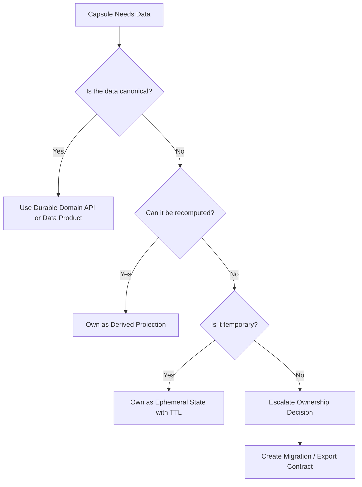

# Data Strategies for Capsule Systems

## The Core Problem

When a system contains many capability capsules—some short-lived, some routinely regenerated—data
ownership becomes a critical architectural concern.

The naive approach is dangerous:

> Every capsule owns its own canonical database.

This creates **distributed data ownership**: a system of many small services each with their own canonical
data stores, duplicated domain models, inconsistent data semantics, and no clear ownership. When
capsules are regenerated, their data may be lost, migrated inconsistently, or orphaned.

This document describes strategies for avoiding distributed data ownership while preserving the disposability
of capability capsules.

---

## Data Classification

Every capsule must classify the data it handles. This classification determines the appropriate
ownership and lifecycle strategy.

| Class | Description | Lifecycle |
|---|---|---|
| **Canonical** | The authoritative record; owned by a durable domain | Must survive capsule regeneration |
| **Derived** | A projection of canonical data; can be recomputed | Can be discarded and rebuilt |
| **Ephemeral** | Temporary state with a clear TTL | Loss is acceptable |
| **Audit** | Append-only record of events or decisions | Must survive; append-only means safe |
| **Configuration** | Governs capsule behavior | Should be externalized from implementation |
| **Personal/sensitive** | Subject to privacy regulation | Requires lifecycle governance regardless of capsule lifecycle |

Only canonical, audit, and personal/sensitive data require strong ownership discipline. Derived,
ephemeral, and configuration data can be treated as part of the disposable layer.

---

## Strategy 1: Durable Domain APIs

Disposable capsules call stable domain APIs for canonical data. The data is owned by the domain, not
the capsule.

**Use when:**
- The capsule needs to read or write canonical data
- The data belongs to an existing domain (customers, products, orders)
- Data consistency matters across capsules

**Example:**

```
Discount Capsule → Customer API → Customer DB (canonical)
Discount Capsule → Product API  → Product DB (canonical)
Discount Capsule → Pricing API  → Pricing DB (canonical)
```

The discount capsule is disposable. The customer, product, and pricing domain APIs are durable.
Regenerating the discount capsule does not affect canonical data.

**Implementation guidance:**
- Domain APIs should have explicit versioned contracts
- Capsules should depend on the contract, not the implementation
- Domain APIs are not capability capsules; they are durable services

---

## Strategy 2: Data Products

Expose governed, curated data products for read-heavy or analytical use cases.

**Use when:**
- Many capsules need the same domain data in the same shape
- Data needs explicit ownership, quality guarantees, and discoverability
- Teams need reusable domain datasets without coupling to internal APIs

**Data product characteristics:**
- Defined output schema with explicit versioning
- Ownership declaration (team, domain)
- Quality SLOs (freshness, completeness, accuracy)
- Discoverable through a data catalog or registry

A data product is not owned by any capsule. It is governed at the domain level and consumed by
capsules as a dependency.

---

## Strategy 3: Derived Projections

Capsules may own projections—read-optimized views of canonical data, shaped for the capsule's
specific query needs.

**Use when:**
- The capsule needs a query shape that does not exist in the domain API
- Performance requires local caching or pre-aggregation
- The projection can be fully rebuilt from canonical sources

**Lifecycle:**
- When a capsule is regenerated, its projection is discarded and rebuilt
- The rebuild process is part of the regeneration recipe
- The projection schema may change between regenerations without coordination

**Example:**

```
Discount Capsule → Projection DB (derived)
                ← rebuilt from Customer API + Product API + Pricing API
```

**Implementation guidance:**
- Always document the rebuild procedure in the regeneration recipe
- Ensure the canonical source APIs can support projection rebuild under load
- Use event replay if the canonical source publishes events

---

## Strategy 4: Ephemeral State

Capsules may own state that has a defined time-to-live and whose loss does not corrupt the business.

**Use when:**
- State represents a session, draft, preview, or in-progress operation
- State expires naturally
- Losing the state requires user action (re-submit, re-login) but does not corrupt data

**Examples:**
- Shopping cart in progress
- Authentication tokens
- Rate-limiting counters
- Draft reports not yet finalized

**Lifecycle:**
- Ephemeral state is part of the disposable layer
- When a capsule is regenerated, ephemeral state is cleared
- The regeneration recipe should document expected state loss behavior

---

## Strategy 5: Event Replay

Capsules can rebuild local state by replaying durable events from an event log.

**Use when:**
- The canonical system publishes events
- The capsule needs local materialized state for performance
- Rebuilding from events is acceptable (latency for rebuild is tolerable)

**Implementation guidance:**
- Event logs must be durable—they are not part of the disposable layer
- Events should be semantically versioned
- The capsule's event consumer logic is disposable; the event log is not
- Regenerated capsules can replay from the beginning of the log or from a snapshot

This strategy aligns closely with event sourcing. The event log is the durable artifact; the
materialized view is the disposable projection.

---

## Strategy 6: Shared Canonical Store with Strict Ownership

In smaller systems or modular monoliths, a shared database with module-enforced ownership can be
appropriate.

**Use when:**
- The system is small enough that separate databases add overhead without benefit
- Ownership is enforced by module boundaries in the code, not physical separation
- Schema boundaries are clear and respected

**Risks:**
- Ownership discipline erodes over time if not enforced tooling
- Cross-module queries are tempting and hard to detect
- Schema migrations require coordination

**Recommendation:** Use this strategy for modular monoliths where module boundaries are enforced by
code review, linting, or architectural tests. Avoid it when teams are working independently.

---

## Strategy 7: Outbox and Inbox Patterns

For reliable integration between disposable capsules and durable systems.

**Outbox pattern:**
- Capsule writes events to a local outbox table in the same transaction as business logic
- A relay process publishes events from the outbox to the event bus
- Ensures at-least-once delivery without distributed transactions

**Inbox pattern:**
- Capsule writes received events to a local inbox table
- Processes events idempotently from the inbox
- Ensures events are not processed twice even if redelivered

**Why this matters for regeneration:**
- When a capsule is regenerated, the outbox relay may need to be restarted
- Inbox idempotency keys must be preserved or rebuilt
- Document outbox and inbox state in the regeneration recipe

---

## Strategy 8: Migration and Export Contracts

If a capsule owns state that may need to survive regeneration or transfer to a durable domain:

**Require:**
1. **Export format** — a documented schema for extracting capsule state
2. **Migration path** — how state is transferred to the new capsule or domain
3. **Schema version** — semantic versioning for the export format
4. **Ownership review** — explicit decision about whether the state should become canonical

**Example scenario:**
- A capsule is initially disposable and owns ephemeral pricing cache
- Over time, the cache data is discovered to have business value
- An ownership review escalates the data to canonical status
- The data is migrated to a durable domain API with an export contract

Without an export contract, capsule regeneration may silently lose data that had accumulated
business value.

---

## Summary: Decision Flow



The core failure mode to avoid — every capsule owning its own canonical database — is described in
[docs/anti-patterns.md](anti-patterns.md) under "Distributed Data Ownership."
